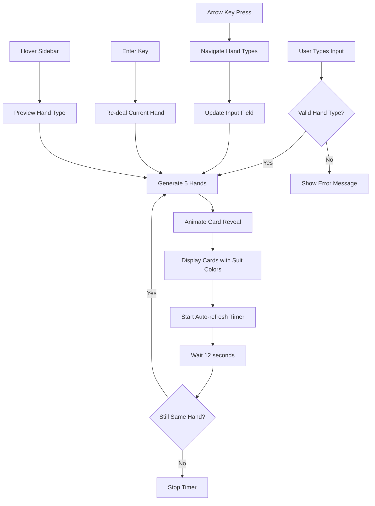

# Poker Hands Visualizer

An interactive web application that generates and displays poker hands in real-time based on user input.

## Features

- Type poker hand names to generate 5 example hands
- Interactive text input with validation and color coding
- Auto-refreshing hands every 12 seconds
- Keyboard navigation with arrow keys
- Visual card representations using Unicode emojis
- Support for all standard poker hands plus random generation

## Usage

Open `index.html` in a web browser. Type any of these hand types:
- `pair`, `two pair`, `three of a kind`
- `straight`, `flush`, `full house`
- `four of a kind`, `straight flush`, `royal flush`
- `random`

### Controls
- **Enter**: Deal new hands of current type
- **↑/↓**: Navigate through hand types
- **Mouse hover**: Preview hand types from sidebar

## Application Flow

## Technical Details

- Single HTML file with embedded CSS and JavaScript
- Uses Unicode playing card emojis (🂡-🂾)
- Implements algorithms for each poker hand type
- No external dependencies or build process required